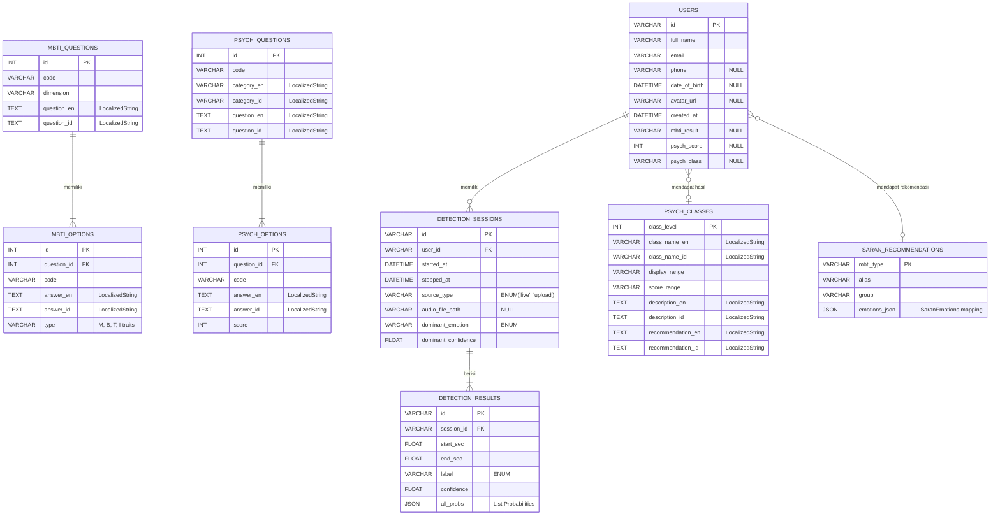

# Application Database ERD

Berikut adalah *Entity-Relationship Diagram* (ERD) dari sistem Fem Psychmonitor. Skema ini dirancang berdasarkan model-model data Dart yang ada di sistem, dan telah dipetakan menjadi struktur tabel relasional yang siap diimplementasikan ke dalam SQLite atau Online Backend.

## Deskripsi Tabel & Standarisasi

### Transaksional (Core Data)
1. **`USERS`**: Menyimpan identitas pengguna dan agregasi hasil *assessment* (MBTI & Nilai Mental Health) setelah proses onboarding selesai.
2. **`DETECTION_SESSIONS`**: Mewakili sesi rekaman atau unggah audio (*one-to-many* ke *users*). Memiliki metadata kapan sesi dimulai/diakhiri serta emosi dominan keseluruhan.
3. **`DETECTION_RESULTS`**: Mencatat *timeline* detik-per-detik hasil inference AI. `all_probs` dapat disimpan sebagai array JSON (Text di SQLite) untuk fleksibilitas.

### Master / Reference Data (Assessment Content)
Sistem kuesioner (*onboarding*) memiliki model *LocalizedString* untuk terjemahan EN dan ID, yang pada tabel di atas dipisahkan menjadi kolom `_en` dan `_id` untuk standarisasi lokalisasi dalam RDBMS.
1. **`MBTI_QUESTIONS` & `MBTI_OPTIONS`**: Menyimpan master pertanyaan tes MBTI beserta opsi jawabannya, termasuk *trait type* (E, I, S, N, T, F, P, J) yang digunakan untuk kalkulasi.
2. **`PSYCH_QUESTIONS` & `PSYCH_OPTIONS`**: Menyimpan master pertanyaan *Womens Mental Health Assessment* beserta bobot skor dari setiap jawaban.
3. **`PSYCH_CLASSES`**: Menyimpan standar kelas *scoring* (seperti Normal, Depresi Ringan, Depresi Sedang, dst) serta rekomendasi aksinya berdasarkan range poin akhir.
4. **`SARAN_RECOMMENDATIONS`**: Memetakan *MBTI_Type* terhadap karakteristik emosional (`happy`, `fear`, `sad`, `disgust`, `angry`, `neutral`) untuk menghasilkan *insight* ke pengguna.

Tabel dan *field* ini sudah dikonfirmasi mencakup seluruh model yang didefinisikan pada sistem Anda (`UserModel`, `DetectionSessionModel`, `DetectionResultModel`, `MbtiModel`, `PsychModel`, `SaranModel`).
